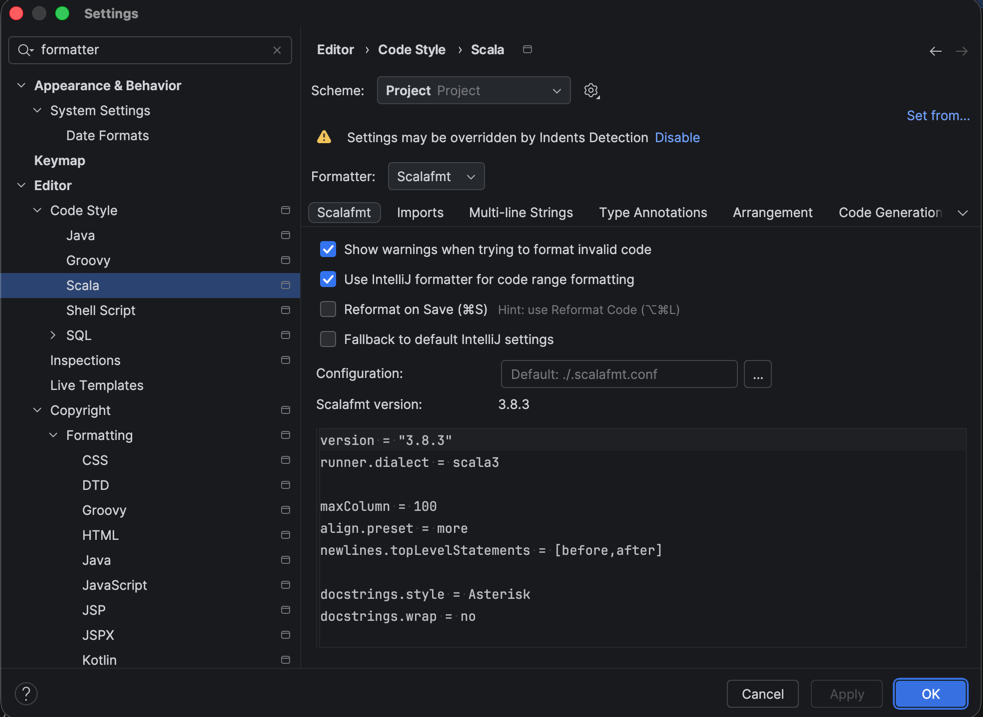

## What to do before a new release
### Update the version in designated file
In ```project/build.properties``` the ```release_version``` field must be changed to a higher version than the one in the last release on github.

If the version is invalid the release will not be made and the GitHub action for the release will fail.

## Prolog testing setup

Tests occasionally utilizes prolog to generate utility classes, the generation is completely automatic upon test startup by running the following command:

```bash
swipl -q -g true -t halt <PROLOG_FILE_NAME>
```

The command above _**REQUIRES**_ the following dependency to be installed:
##### Linux
```bash
sudo apt install swi-prolog
```
##### MacOs
```bash
brew install swi-prolog
```
##### Windows
Visit and follow the instructions on the official site: https://www.swi-prolog.org/download/stable

## Project Formatter Settings

### IntelliJ 

Go to the IDE settings and type ```formatter``` in the searchbar, then select ```Editor > Scala```, you should see something like the provided image: 



In Formatter select Scalafmt and you are all set!

### Any other IDE or Terminal
You can run in any terminal the following command to format all the project files:
```bash
sbt scalafmtAll
```

There are also the following counterparts:

```bash
sbt scalafmt              # formats only the files in the main package
sbt test:scalafmt         # formats only the files in test package
sbt scalafmtSbt           # formats only the build files like build.sbt or project/*.scala
```